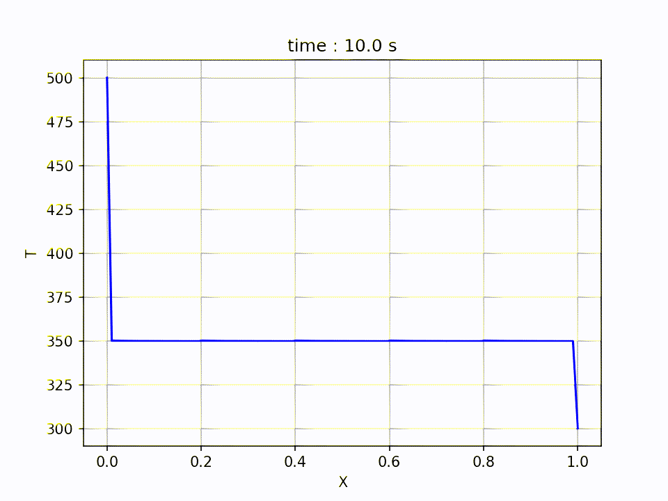

# 1D heat conduction equation solution using Dufort-Frankel scheme
in this code, the 1D heat conduction equation is solved using dufort frankel scheme
as this scheme is unconditionally stable explicit one.

The scheme is verified to be unconditionally stable, as the timestep provided was dt = 10 s
and the simulation proceeded without any crash.

the animated results can be seen below

