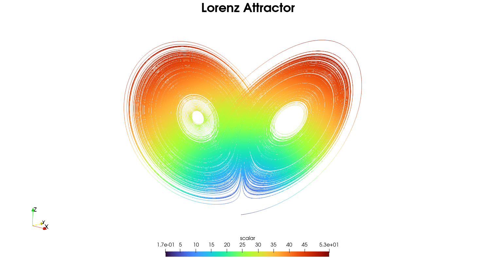

# Lorenz Attractor
This code generates the Lorentz Attractor contour using 3 governing equations.
The animation generated shows a good 3d view of the contour.

Through this work, the significance of Chaos in the computing has been
understood. The inspiration came from "Chaos, Making a new science" by James
Gleick, and from Boundary Layer Theory notes (study on stability of turbulence).

