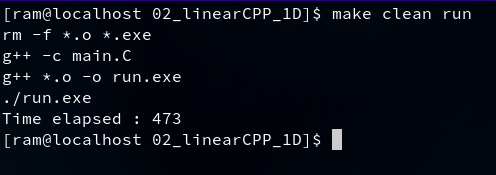
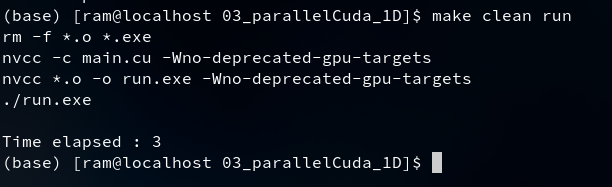

# Matrix Multiplication C++ code using CUDA parallelization

This is my first GPU/CUDA program writen in C++ that performs matrix
multiplication. The code was tested with 4001x4001 matrices on CPU serial run and on Nvidia L4
GPU/CUDA parallel run. More than 100 times speed was observed in CUDA run.

## directories

- *01_linearCPP_2D* directory contains C++ serial code writen with 2D arrays
of matrix multiplication.

- *02_linearCPP_1D* directory contains the C++ serial code written with 1D flattened arrays
for ease of programming.

- *03_parallelCuda_1D* directory contains the C++/CUDA code that does the same matrix
multiplication in parallel.

## computation procedure

- In both serial and parallel versions of the code. Two matrices each of size 4001X4001
was initialized with random integer values.

- The matrices were allocated into 1D arrays for ease of access through reference in memory.

- Nvidia L4 graphics card was used for this work. 2D blocks of size (126,126) with
2D threads of size (32,32) each was allocated and utilized.

- The initialized and computed matrices were writen to .mat files.

- Serial version of code took about 473 seconds as shown in following screenshot.

- Parallel version of code took just 3 seconds to perform the same task as shown below.

- Nvidia CUDA toolkit version 12.4 was used in the work.
